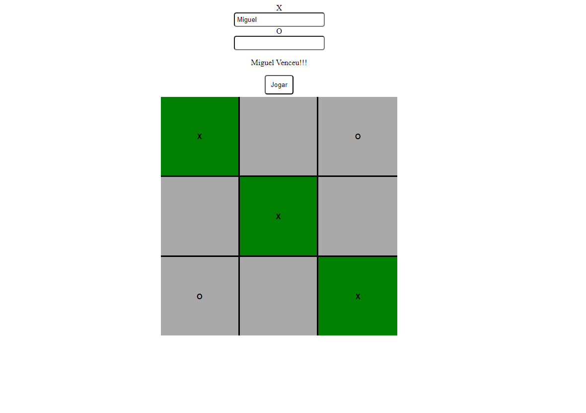

<h1 align="center">❌⭕ Jogo da Velha</h1>

<p align="center">
  Um clássico jogo da velha feito em HTML, CSS e JavaScript 😄
</p>

---

### 📌 Tecnologias Utilizadas
<div>
  
  
  
</div>

---

### ✨ Funcionalidades

✔️ Interface intuitiva e responsiva  
✔️ Indicação visual do vencedor  
✔️ Reinício rápido da partida  
✔️ Jogabilidade para 2 jogadores

---

### 🎮 Layout



> *(Opcional: posso criar um GIF animado demonstrando a jogada! 🎥)*

---

### 🚀 Como executar o projeto

```bash
# Clonar o repositório
git clone https://github.com/miguelfelipe09/ticTacToe.git

# Abrir o projeto
Abra o arquivo "TicTacToe.html" diretamente no navegador
```

---

👨‍💻 Autor

Miguel Felipe da Silva

📎 LinkedIn: https://www.linkedin.com/in/miguel-felipe-aab18523a/
